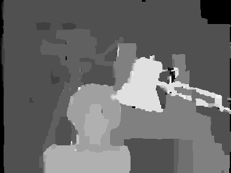

# Belief Propagation for Stereo Matching (Accelerated2)

> **Repository Moved**  
> This repository has been moved to a new location and is no longer maintained here.  
> Please visit the new repository: https://github.com/aposb/loopy-belief-propagation-for-stereo-matching  
> This repository is archived and kept for reference only.

A C++ implementation of Loopy Belief Propagation for stereo matching. It uses the "min-sum" variation of the algorithm and the "Accelerated2" (Right/Down-Left/Up sweep) message update schedule.

## Input Image
The Tsukuba stereo image that used as input.

   

## Output Image
The disparity map that created at the output.

   

